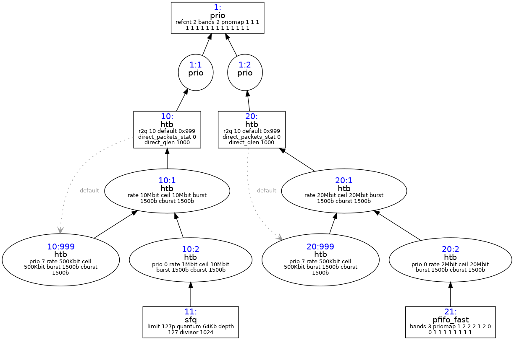

tc commands 
```bash

tc qdisc add dev lo root handle 1: prio bands 2 priomap 1 1 1 1 1 1 1 1 1 1 1 1 1 1 1 1
tc qdisc add dev lo parent 1:1 handle 10: htb default 999
tc qdisc add dev lo parent 1:2 handle 20: htb default 999

tc class add dev lo parent 10: classid 10:1 htb rate 10Mbit
tc class add dev lo parent 10:1 classid 10:999 htb rate 500kbit ceil 500kbit prio 999
tc class add dev lo parent 10:1 classid 10:2 htb rate 1Mbit ceil 10Mbit
tc qdisc add dev lo parent 10:2 handle 11:2 sfq


tc class add dev lo parent 20: classid 20:1 htb rate 20Mbit
tc class add dev lo parent 20:1 classid 20:999 htb rate 500kbit ceil 500kbit prio 999
tc class add dev lo parent 20:1 classid 20:2 htb rate 2Mbit ceil 20Mbit
tc qdisc add dev lo parent 20:2 handle 21:2 pfifo_fast

```

