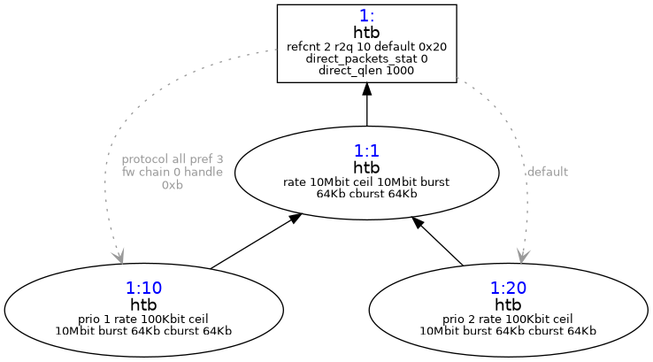

tc commands 
```bash

tc qdisc add dev lo root handle 1: htb default 20
tc class add dev lo parent 1: classid 1:1 htb rate 10240kbit
tc class add dev lo parent 1:1 classid 1:10 htb rate 100kbit ceil 10240kbit prio 1
tc class add dev lo parent 1:1 classid 1:20 htb rate 100kbit ceil 10240kbit prio 2

tc filter add dev lo parent 1: protocol all prio 3 handle 11 fw flowid 1:10

```

