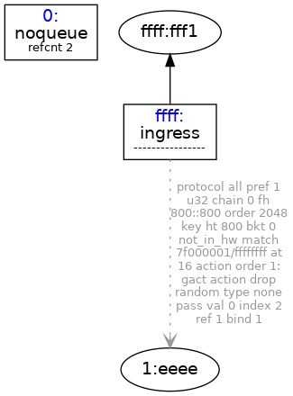

This code impement following tc commands, drop all packet from `lo` to `lo`


```bash
tc qdisc add dev lo ingress
tc filter add dev lo parent ffff: protocol all prio 1 u32  match ip dst 127.0.0.1/32  flowid 1:1 action drop

tc qdisc del dev lo ingress
```

